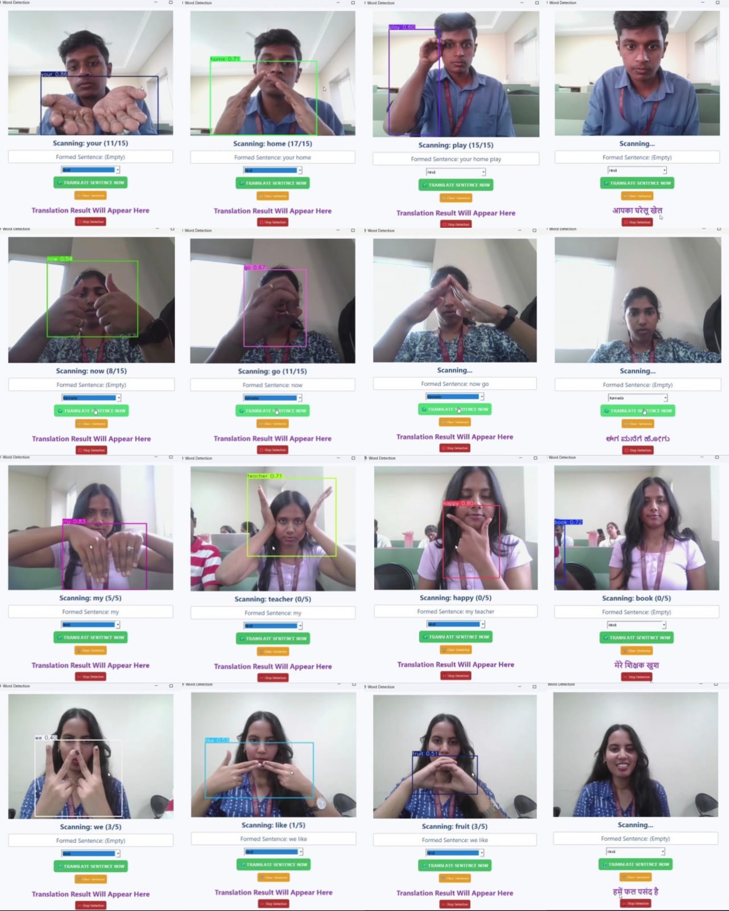

# 🤟 Indian Sign Language to Regional Text Using Deep Learning

<div align="center">


**A real-time sign language recognition system that converts hand gestures into multilingual text (English → Kannada / Hindi) using YOLOv8 object detection.**

*B.E. Final Year Project — Department of Computer Science & Engineering, EPCET, VTU | 2025–26*

</div>

---

## 📌 Table of Contents

- [Overview](#overview)
- [Demo](#demo)
- [Features](#features)
- [Tech Stack](#tech-stack)
- [System Architecture](#system-architecture)
- [Installation](#installation)
- [Usage](#usage)
- [Supported Gestures](#supported-gestures)
- [Model Performance](#model-performance)
- [Project Structure](#project-structure)
- [Team](#team)
- [Publication](#publication)

---

## Overview

The deaf and hard-of-hearing (DHH) community in India relies on Indian Sign Language (ISL) for communication, but most public spaces — hospitals, schools, offices — have no way to interpret it. Existing solutions either require expensive hardware (sensor gloves, depth cameras) or only work in English.

This system bridges that gap using a standard webcam. It detects 25 common ISL hand gestures in real time, constructs meaningful English sentences from detected signs, and translates the output into Kannada or Hindi — no specialized hardware required.

**Key numbers:**
- 25 custom gesture classes trained from scratch
- mAP@0.50 of ~1.0 across all classes (near-perfect detection)
- mAP@0.50:0.95 ranging from 0.79 to 0.95 (strong localization)
- Real-time inference at 15–25 FPS on standard consumer hardware
- Stable operation confirmed over 30-minute continuous sessions
- 11% plagiarism similarity score (DrillBit certified)

---

## Demo

The system detects gestures frame-by-frame, buffers confirmed words, builds a sentence, and translates it on demand.

**Example flows:**

| Gestures Performed | English Sentence | Kannada Translation |
|:-------------------|:-----------------|:--------------------|
| your → home → play | "your home play" | ನಿಮ್ಮ ಮನೆ ಆಟ |
| now → go → home | "now go home" | ಈಗ ಮನೆಗೆ ಹೋಗು |
| my → teacher → happy | "my teacher happy" | ಮೇರೇ ಶಿಕ್ಷಕ ಖುಷ |
| we → like → fruit | "we like fruit" | हमें फल पसंद है |

---

## Features

- **Real-time gesture detection** — YOLOv8 runs inference on every webcam frame with bounding boxes and confidence scores
- **Temporal smoothing** — a word is only added to the sentence after being detected consistently across multiple frames, eliminating flicker and false positives
- **Sentence construction** — sequential gestures are buffered and joined into coherent English sentences; duplicate words are filtered automatically
- **Multilingual translation** — completed sentences translate to Kannada or Hindi via the Deep Translator API
- **Interactive PyQt5 dashboard** — live video feed, detected words, formed sentence, and translation output all in one interface
- **Lightweight deployment** — runs on Intel i3 + 4 GB RAM; no GPU required for inference
- **Session logging** — optional saving of detection logs and sentences for review or dataset expansion

---

## Tech Stack

| Component | Technology |
|:----------|:-----------|
| Gesture Detection | YOLOv8 (Ultralytics) |
| Video Capture & Frame Processing | OpenCV (cv2) |
| Deep Learning Framework | PyTorch |
| GUI | PyQt5 |
| Translation | Deep Translator API (googletrans / transformers) |
| Dataset Annotation | LabelImg |
| Language | Python 3.8+ |
| Numerical Processing | NumPy, Pandas |
| Image Handling | Pillow, torchvision |
| Version Control | Git / GitHub |

---

## System Architecture

```
┌─────────────┐
│   Webcam    │  ← Standard USB or built-in camera
└──────┬──────┘
       │ video frames
       ▼
┌─────────────┐
│ Preprocessor│  ← Resize to 640×640, normalize, BGR→RGB, to_tensor
└──────┬──────┘
       │ tensor
       ▼
┌──────────────┐
│ YOLOv8       │  ← Custom-trained weights (best.pt), 25-class detection
│ Detector     │
└──────┬───────┘
       │ bounding boxes + confidence scores + class IDs
       ▼
┌──────────────┐
│ PostProcessor│  ← NMS, confidence threshold (0.4–0.5), temporal smoothing
└──────┬───────┘
       │ stable word label
       ▼
┌──────────────────┐
│ SentenceBuilder  │  ← Buffer list, duplicate filter, sentence join
└──────┬───────────┘
       │ English sentence
       ▼
┌──────────────┐
│ Translator   │  ← Deep Translator API → Kannada / Hindi
└──────┬───────┘
       │ translated text
       ▼
┌──────────────────┐
│ PyQt5 Dashboard  │  ← Live feed + boxes + sentence + translation + controls
└──────────────────┘
       │
       ▼ (optional)
┌──────────────┐
│ Logger       │  ← Detection logs, session sentences
└──────────────┘
```

---

## Installation

### Prerequisites

- Python 3.8 or above
- pip
- A webcam (USB or built-in)
- Windows 10/11 or Ubuntu 18.04+

### Steps

```bash
# 1. Clone the repository
git clone https://github.com/rupin2207/isl-to-regional-text.git
cd isl-to-regional-text

# 2. Create a virtual environment
python -m venv venv
source venv/bin/activate        # Linux/Mac
venv\Scripts\activate           # Windows

# 3. Install dependencies
pip install -r requirements.txt

# 4. Download the trained model weights
# Place best.pt in the /weights directory
# (Download link in releases or contact the team)
```

### `requirements.txt`

```
ultralytics>=8.0.0
opencv-python>=4.7.0
PyQt5>=5.15.0
torch>=1.13.0
torchvision>=0.14.0
numpy>=1.23.0
Pillow>=9.0.0
deep-translator>=1.9.0
```

---

## Usage

```bash
# Run the main application
python main.py
```

**Dashboard controls:**

| Button | Action |
|:-------|:-------|
| Start | Activates webcam and begins real-time detection |
| Stop | Pauses the video feed |
| Clear Sentence | Resets the word buffer and sentence display |
| Translate | Sends the formed English sentence to the translation module |
| Exit | Closes the application and releases camera resources |

**How to use it:**
1. Click **Start** — the camera feed appears with live bounding boxes
2. Perform ISL gestures one at a time in front of the camera
3. Hold each gesture steady — the scanning counter (e.g., 3/5) confirms detection before adding the word
4. Watch the sentence build in the "Formed Sentence" field
5. Select a target language (Kannada / Hindi) from the dropdown
6. Click **Translate** to see the regional language output


---

## Supported Gestures

The model is trained on 25 custom ISL word classes:

| | | | | |
|:---|:---|:---|:---|:---|
| book | drink | eat | friend | fruit |
| go | happy | he | home | I |
| like | my | name | now | park |
| play | read | school | she | teacher |
| tired | today | we | you | your |

> To add new gestures: collect and annotate images using LabelImg (YOLO format), retrain with the provided `train.py` script, and replace `best.pt` with the new weights.

---

## Model Performance

### Detection vs. Localization Precision (Top 10 Classes)

| Class | mAP@0.50 (Detection) | mAP@0.50:0.95 (Localization) |
|:------|:--------------------:|:----------------------------:|
| play | 1.0 | ~0.83 |
| read | 1.0 | ~0.91 |
| school | 1.0 | ~0.93 |
| she | 1.0 | ~0.94 |
| teacher | 1.0 | ~0.78 |
| tired | 1.0 | ~0.79 (lowest) |
| today | 1.0 | ~0.90 |
| we | 1.0 | ~0.84 |
| you | 1.0 | ~0.83 |
| your | 1.0 | ~0.92 |

**Key observations:**
- mAP@0.50 is 1.0 across all tested classes — the model always identifies the correct sign
- Localization precision (mAP@0.50:0.95) is the harder metric; "tired" scores lowest (~0.79) due to bounding box imprecision, not misclassification
- The confusion matrix shows a strong diagonal with near-zero off-diagonal entries, confirming minimal class confusion

### Non-Functional Performance

| Metric | Target | Achieved |
|:-------|:------:|:--------:|
| Inference FPS | ≥ 15 | 15–25 FPS |
| Translation latency | < 1 second | ✅ |
| Continuous runtime stability | 30 minutes | ✅ No crashes |
| Confidence threshold for word acceptance | > 80% | ✅ |

---

## Project Structure

```
isl-to-regional-text/
│
├── main.py                  # Entry point — launches PyQt5 dashboard
├── requirements.txt
│
├── weights/
│   └── best.pt              # Trained YOLOv8 model weights
│
├── modules/
│   ├── camera.py            # Webcam capture (cv2.VideoCapture)
│   ├── preprocessor.py      # Resize, normalize, to_tensor
│   ├── detector.py          # YOLOv8 inference (YOLODetector class)
│   ├── postprocessor.py     # NMS, temporal smoothing, confidence filter
│   ├── sentence_builder.py  # Buffer management, duplicate filter
│   ├── translator.py        # English → Kannada / Hindi via Deep Translator
│   └── logger.py            # Session logging (optional)
│
├── gui/
│   └── dashboard.py         # PyQt5 main window + video thread
│
├── dataset/
│   ├── images/              # Training and validation images
│   ├── labels/              # YOLO-format annotation .txt files
│   └── data.yaml            # YOLOv8 dataset config
│
├── train.py                 # Model training script
└── docs/
    └── report.pdf           # Full project report
```

---

## Team

| Name | USN | Role |
|:-----|:----|:-----|
| Rupin R | 1EP22CS083 | Model training, backend pipeline, system integration |
| Thanisha M Shetty | 1EP22CS111 | Dataset collection, GUI development |
| Tanushree J | 1EP22CS109 | Annotation, testing, translation module |
| Varsha D | 1EP22CS117 | UI design, documentation, result analysis |


---


---

## Future Work

- Hybrid CNN + LSTM model for capturing dynamic/motion-based signs
- Android and iOS app deployment
- Offline translation support (no internet required)
- Expanded vocabulary beyond 25 words
- Edge device deployment (Raspberry Pi, Jetson Nano)
- Text-to-speech output for complete two-way communication

---

<div align="center">

*Built to reduce the communication gap between the deaf and hearing communities.*

</div>
